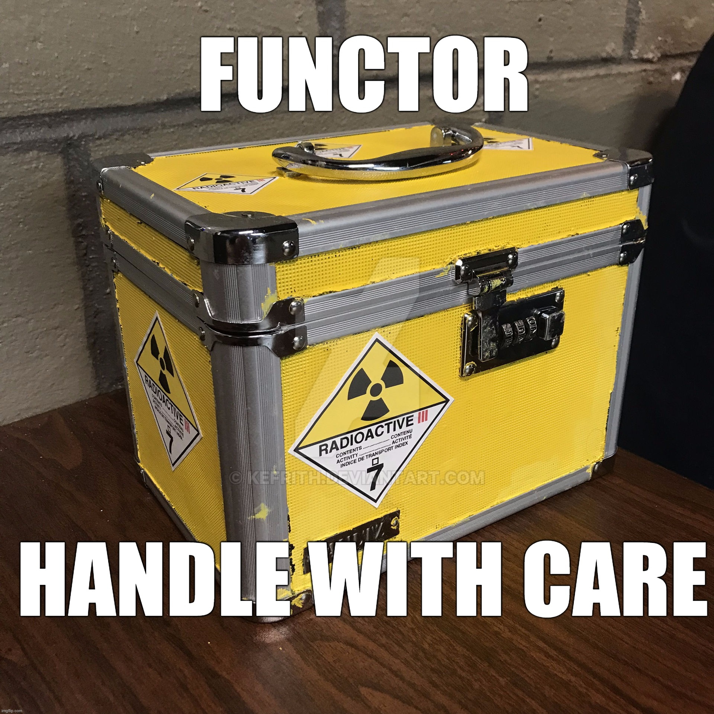

# Functors

Data are really functions. Functions are really data. There is no hard-core distinction, and then we will actually talk about what a function type is in category theory. Then you will see that it is actually an exponential, which is a data type.
  
Now you understand why I say it's okay to think of functors as containers, and you just have to expand your mind to think of containers in a larger, general way. I mean, there is something in C++ called a future. A future contains a value that is to be evaluated by some thread going in the background. So, does the future contain this value? Well, maybe it doesn't because it hasn't finished evaluating it yet. But you can think of it as a container that contains this value, even if it contains it only virtually. What is important is that you can apply a function to this value. You don't care whether this value has been evaluated yet or not. If it's being evaluated, then you know maybe it will apply this function immediately. If it hasn't been, it will just memorize this function, remember it for later, and then apply it when the value arrives.

The only thing about a functor that's important is that you can apply a function to what it contains. There is no way, at least the functor does not provide you a way, of retrieving this value. That's not part of the definition of a functor. In this sense, you don't know whether this value is there or isn't it. All you know is that you can operate on this value. Like this is a radioactive value. You have the gloves, you put it there, and you operate on this. You can never take it out because you die. There can be a functor like this. Is it a container? Well, yeah, I think it is.